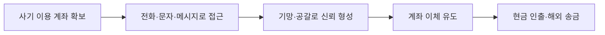
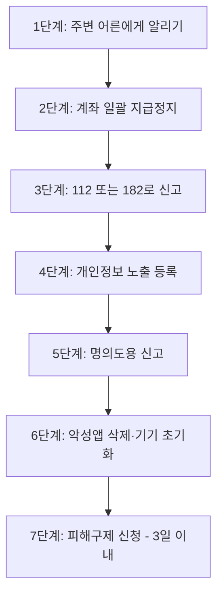

# 금융 사기
{: .no_toc }

청소년이 노출되기 쉬운 금융 사기 수법과 대응 방법을 정리했습니다.
{: .fs-6 .fw-300 }

## 목차
{: .no_toc .text-delta }

1. TOC
{:toc}

---

## 왜 청소년이 금융 사기에 노출되는가

금융 사기는 흔히 어른들의 이야기처럼 들리지만, 실제로 **청소년이 더 취약한 영역**이 있습니다.

- 부모님 몰래 무언가를 사고 싶을 때, "**조용히 빌릴 수 있다**"는 유혹에 약합니다.
- 친구·지인 사칭 메시지에 의심 없이 답하기 쉽습니다.
- 중고거래나 콘서트 티켓 거래처럼 청소년이 활발히 참여하는 시장은 그만큼 사기의 표적이 됩니다.
- 본인 명의가 아닌 거래(부모님 카드, 친구 계좌 등)가 잦으면 피해 사실을 빠르게 인지하기 어렵습니다.

다음 흐름을 알아두면 사기 수법은 의외로 비슷한 패턴을 가지고 있다는 것을 알게 될 거예요.

---

## 알아두어야 할 핵심 용어

### 전기통신금융사기란?

**법률적 정의**: 전기통신을 이용하여 타인을 기망(欺罔)·공갈함으로써 재산상의 이익을 취하거나 제3자에게 재산상의 이익을 취하게 하는 행위.

법은 이 행위를 다음 네 가지로 나눠 정의하고 있습니다.

| 유형 | 설명 |
|:---|:---|
| 가 | 자금을 송금·이체하도록 하는 행위 |
| 나 | 개인정보를 알아내어 자금을 송금·이체하는 행위 |
| 다 | 자금을 교부받거나 교부하도록 하는 행위 |
| 라 | 자금을 출금하거나 출금하도록 하는 행위 |

단, 정상적인 재화·용역 공급은 제외되지만, "**대출의 제공·알선·중개를 가장한 행위**"는 포함됩니다. 즉, "대출해줄게"라며 접근하는 것 자체가 사기의 한 형태로 정의되어 있다는 뜻입니다.

### 피싱 (Phishing)

**개인정보(private data)를 낚는다(fishing)** 는 의미의 합성어입니다.

전화·문자·메신저·가짜사이트 등 다양한 전기통신 수단을 이용하여 피해자를 속이거나 협박해서 개인정보·금융정보를 빼낸 뒤 금품을 갈취하는 사기 수법 전반을 가리킵니다. 아래에 소개하는 보이스피싱, 스미싱은 모두 피싱의 한 종류입니다.

### 보이스피싱 (Voice + Phishing)

유선전화의 발신번호를 수사기관·금융기관 등의 번호로 조작하여 해당 기관을 사칭하면서 금품을 편취하는 수법입니다.

자녀 납치·사고를 빙자하거나, "당신의 계좌가 범죄에 이용되었다"고 협박하는 식으로 **불안과 공포를 이용**하는 것이 특징입니다.

### 스미싱 (SMS + Phishing)

**문자 메시지(SMS)와 피싱(phishing)의 합성어**입니다. 문자 메시지에 악성 앱이나 악성코드 설치를 유도하는 링크를 담아 보내고, 휴대전화의 소액결제 정보 등을 가로채는 수법입니다.

자주 보이는 미끼 메시지:

- "[택배] 주소 불명으로 배송이 보류되었습니다. 확인 → (수상한 링크)"
- "[건강검진] 결과 확인 → (링크)"
- "[법원] 출석 통지서 → (링크)"
- "[지원금] 신청 가능 → (링크)"

링크를 클릭하는 순간 악성앱이 설치되어 개인정보·인증번호·금융 데이터가 줄줄이 빠져나갈 수 있습니다.

### 대리입금 ('댈입')

{: .important }
> 청소년이 가장 많이 노출되는 금융 사기 유형입니다. 꼭 알아두세요.

**(주로) 청소년을 유인하여 10만 원 안팎의 소액을 초고금리로 대출하는 불법 사금융**입니다. SNS, 트위터, 카카오톡 오픈채팅 등에서 "**5만 원 빌려드림**", "**소액 댈입 가능**" 같은 글로 접근합니다.

대리입금이 특히 위험한 이유는 다음과 같습니다.

**1. 친숙한 용어로 경계심을 흐립니다**

| 진짜 의미 | 사용하는 용어 |
|:---|:---|
| 이자 | 수고비, 사례비 |
| 연체료 | 지각비 |
| 대출 | 대리입금, 댈입 |

"이자"라고 하면 무서운데 "수고비"라고 하면 부담이 적게 느껴지죠. 이 심리를 노린 것입니다.

**2. 이자율이 살인적입니다**

대출 원금 10만 원에 "수고비" 3만 원, 갚는 기간은 1주일. 이걸 연이율로 환산하면 **수천 % 단위**입니다. 법정 최고이자율(연 20%)을 수십 배 초과하는 불법 사금융입니다.

**3. 법망을 교묘하게 피합니다**

이자제한법은 대출 원금이 10만 원 이상일 때 적용됩니다. 그래서 대리입금 업자들은 일부러 **9만 원, 8만 5천 원** 같은 금액으로 빌려주면서 법망을 피합니다.

**4. 갚지 못하면 2차 범죄로 이어집니다**

대리입금을 받을 때 보통 학교, 부모님 연락처, 학생증 사진 등을 요구합니다. 갚지 못하면 이를 빌미로 **협박·공갈**이 시작되고, 협박 메시지를 가족·친구·학교에 뿌리겠다고 위협하는 사례가 많습니다.

{: .warning }
> 친구가 "이거 진짜 안전해, 나도 써봤어"라며 대리입금을 권하더라도 **절대 응하지 마세요**. 작은 금액이라도 한번 발을 들이면 빠져나오기가 매우 어렵습니다. 이미 받았다면 혼자 해결하려 하지 말고 부모님·선생님·경찰(112, 182)에게 즉시 알리세요.

---

## 청소년이 자주 노출되는 사기 유형

### 1. 메신저 피싱 (지인 사칭)

가족·친구를 사칭하여 카카오톡, 문자 등으로 접근해 "휴대폰이 고장났어, 급한 일이 있어"라며 돈을 요구하거나, 본인 인증을 위한다며 신분증 사진·인증번호를 요구합니다.

**위험 신호**

- 평소와 다른 번호·계정으로 연락이 옴
- 통화는 안 되고 메시지로만 대화함
- "엄마/아빠한테는 절대 말하지 마"라는 식의 단속이 동반됨

### 2. 자녀 납치·사고 빙자

부모님께 "당신의 자녀를 데리고 있다"며 협박하는 수법입니다. 실제로 학생은 무사한 경우가 대부분이지만, 부모님이 당황한 사이 돈이 송금됩니다.

**가족과 미리 정해두면 좋은 것**

- 가족만 아는 **암구호(예: 좋아하는 음식 이름)** 를 정해두기
- 의심스러운 전화가 오면 일단 끊고 자녀에게 직접 전화해 보기

### 3. 중고거래 사기

당근마켓, 번개장터 등에서 흔히 발생합니다. 입금만 받고 물건을 보내지 않거나, 가짜 송장번호를 보내는 식입니다.

### 4. 티켓 사기

콘서트·아이돌 굿즈·스포츠 경기 티켓을 빌미로 합니다. 인기 공연 티켓은 정가의 몇 배에 거래되기도 하므로 청소년들이 빠지기 쉬운 함정입니다.

### 5. 금융회사·금감원 사칭

"당신 명의로 대출이 신청되었으니 본인 확인이 필요하다", "당신의 계좌가 범죄에 연루되었다" 등 공포심을 이용해 개인정보를 빼내는 수법입니다.

### 6. 카드론·텔레뱅킹 이용 편취

피해자의 인터넷뱅킹·텔레뱅킹 정보를 빼내 카드론(신용카드 대출)을 받고 그 돈을 가로채는 수법입니다. 본인은 카드를 만진 적도 없는데 빚이 생기는 무서운 사례입니다.

---

## 예방 — 평소 지킬 7가지

{: .note }
> 다음 7가지만 지켜도 대부분의 디지털 금융사기에서 자신을 보호할 수 있습니다.

1. **출처 미확인 문자메시지 URL은 절대 클릭하지 않기**
2. **알 수 없는 출처의 어플은 설치하지 않기** — 반드시 Google Play, App Store 등 공식 마켓 이용
3. **휴대폰에 백신 프로그램 설치하기**
4. **소액결제 한도를 0원으로 설정하거나 차단하기** (통신사 고객센터에서 가능)
5. **보안 명목으로 금융정보를 요구하면 절대 입력하지 않기** — 진짜 금융기관은 그렇게 묻지 않습니다
6. **전자금융사기 예방서비스에 가입하기** — 본인 계좌에 출금 단계 추가 인증을 거는 서비스
7. **개인정보를 함부로 노출하지 않기** — 학생증·신분증 사진, 계좌번호, 비밀번호 모두 마찬가지

---

## 대응 — 피해가 발생했을 때 시간 순서

피해가 발생하면 **시간이 가장 중요**합니다. 사기범이 돈을 인출하기 전에 가능한 한 빨리 움직여야 합니다.

### Step 1. 주변 어른에게 즉시 알리기

부모님, 선생님, 또는 믿을 수 있는 친척에게 **숨기지 말고** 알리세요. 사기 피해는 빠르게 알릴수록 회수 가능성이 높아집니다.

### Step 2. 계좌 일괄 지급정지 신청 ⏱️ 가장 먼저!

- **계좌정보통합관리서비스**(payinfo.or.kr)에서 본인 명의 모든 계좌를 한 번에 정지할 수 있습니다.
- 또는 가까운 은행 영업점에 방문하여 신청 가능합니다.
- 사기범이 돈을 옮기지 못하도록 막는 가장 중요한 단계입니다.

### Step 3. 신고

- **경찰서 112** (긴급)
- **사이버범죄 신고 182** (상담·민원)
- **금융감독원 1332** (금융 피해)
- **사이버범죄 신고시스템 ECRM** (ecrm.police.go.kr) — 온라인으로 신고 접수

{: .warning }
> 경찰서를 방문할 때는 일반 지구대·파출소가 아니라 **'경찰서'(예: ○○경찰서)** 본청을 방문해야 사이버범죄 담당이 응대합니다.

### Step 4. 개인정보 노출 등록

**개인정보 노출자 사고예방시스템** (pd.fss.or.kr)에 본인 정보가 노출되었음을 등록합니다. 이렇게 하면 사기범이 노출된 정보로 금융 거래를 시도할 때 자동으로 차단됩니다.

### Step 5. 명의도용 신고

**명의도용방지서비스** (msafer.or.kr)에 명의도용을 신고하여, 본인 모르게 휴대전화나 신용카드가 개설되는 것을 방지합니다.

### Step 6. 악성앱 삭제 및 휴대전화 초기화

스미싱으로 의심되는 앱이 설치되었거나, 악성코드 감염이 의심되면:

- 즉시 해당 앱 삭제
- 안전을 위해 휴대폰을 **초기화** (백업 후 공장 초기화)
- 통신사·은행 비밀번호·인증서를 모두 새로 발급·변경

### Step 7. 피해구제 신청 (지급정지 후 3일 이내)

이게 가장 중요합니다. **은행 영업일 기준 3일 이내**에 다음 절차를 밟아야 합니다.

1. 경찰서에서 **'사건사고사실확인서'** 발급받기
2. 지급정지를 신청했던 금융회사 영업점 방문 (신분증 지참)
3. 피해구제 신청서 제출

기한을 넘기면 지급정지가 풀려 돈이 사기범에게 넘어갈 수 있으니 반드시 기한을 지키세요.

---

## 사기 유형별 예방·대응 가이드

### 🛒 중고거래 사기

#### 예방

- **거래자의 거래후기·거래전적** 확인하기 — 신규 계정, 후기 없는 계정은 주의
- 게시글에 표시되지 않은 정보(실물 사진, 상품 상태 등)를 **인증 요청**하기
- 가능하면 **성인과 동행**하기 — 특히 고가품
- **계좌이체 우선**: 돈을 받은 다음 물건을 거래
- **지나친 개인정보(학생증, 계좌 비밀번호) 제공 금지**
- 카카오톡 오픈채팅 등 **외부 메신저로 유도**하면 의심하기 — 플랫폼 안에서 거래해야 분쟁 시 보호받기 쉬움

#### 대응

| 채널 | 용도 |
|:---|:---|
| **112** | 긴급 신고 |
| **182** | 사이버범죄 민원·상담 |
| **ECRM** (ecrm.police.go.kr) | 온라인으로 정식 신고 접수 |
| **플랫폼 분쟁조정센터** | 당근마켓, 번개장터 등 자체 고객센터 |
| **전자문서·전자거래 분쟁조정위원회** | 합의 실패 시 |
| **118** (KrCERT/CC) | 인터넷 침해사고 신고 |

### 🎫 티켓 사기

#### 예방

거래 전에 다음 도구로 상대방을 검증하세요.

| 도구 | 무엇을 확인할 수 있나 |
|:---|:---|
| **경찰청 사이버캅** (앱 또는 웹) | 거래자 전화번호·계좌번호 사기 신고 이력 |
| **더치트** (thecheat.co.kr) | 사기 계좌·연락처 통합 데이터베이스 |
| **금융회사별 사기의심계좌 조회** | 예: KB스타뱅킹 앱의 '사기의심계좌' 메뉴 |

**자유적금 계좌 주의**

사기범들은 한 사람당 여러 개를 만들 수 있는 **적금 계좌**를 자주 이용합니다. 일반 입출금 계좌와 적금 계좌는 은행마다 계좌번호 패턴이 다르므로, 금융감독원이 공개한 [은행별 적금 계좌번호 구분 방법](https://fss.or.kr/fss/bbs/B0000175/view.do?nttId=135252&menuNo=200204)을 참고하세요.

**추가 검증**

- 예매내역 캡처와 실물 티켓 인증 요청
- 양도 가능한 티켓인지 공식 사이트에서 확인
- 가격이 비정상적으로 싸면 의심

#### 대응

- **사기 증거 자료를 미리 수집**: 입금 전부터 채팅 내용, 거래자 연락처, 계좌번호, 닉네임을 캡처해 두세요.
- **ECRM 신고**: 증거 자료 첨부 후 피해진술서 작성. 온라인 접수 후 14일 이내에 경찰서에서 정식 접수됩니다. 만 14세 이상 본인만 신고 가능합니다.
- **국번 없이 182** 로 가까운 경찰서 안내 받기

### 📞 보이스피싱 / 스미싱

#### 예방 체크리스트

- [ ] 모르는 번호의 문자에 있는 링크는 절대 누르지 않는다
- [ ] 공공기관·은행은 **전화로 개인정보를 절대 묻지 않는다** — 누구든 묻는다면 사기다
- [ ] 가족 사고 전화가 오면 일단 끊고 **직접 가족에게 전화**해본다
- [ ] 휴대폰 소액결제 한도를 **0원**으로 설정해둔다
- [ ] 알 수 없는 출처의 앱은 설치하지 않는다

#### 대응

위의 **Step 1~7** 표준 대응 순서를 그대로 따르세요. 특히 Step 2(계좌 일괄 지급정지)와 Step 7(3일 이내 피해구제 신청)이 가장 중요합니다.

---

## 알아두면 든든한 제도

### 지연인출제도

100만 원 이상이 입금된 계좌에서 자동화기기(ATM)로 출금할 때 **30분간 출금이 지연**되는 제도입니다. 사기범이 즉시 돈을 빼가지 못하도록 시간을 벌어주는 안전장치입니다.

### 한도 제한계좌 제도

일정 조건을 만족하지 못한 신규 계좌는 **1일 출금 한도가 제한**됩니다. 보통:

- 창구 출금: 1일 100만 원
- ATM·인터넷뱅킹 출금: 1일 30만 원

청소년이 처음 만든 계좌도 이 한도가 걸려 있을 수 있어요. 한도를 풀려면 급여이체·공과금 자동이체 등의 실적을 만들거나, 은행 영업점에 방문해 사용 목적을 증빙해야 합니다.

이 제도는 **본인을 불편하게 하는 것 같지만, 실제로는 본인을 지키는 장치**입니다. 사기범이 명의도용으로 계좌를 만들어도 큰 금액을 한 번에 인출하지 못하게 됩니다.

---

## 한눈에 보는 신고 번호

| 상황 | 번호 |
|:---|:---:|
| 긴급 신고 | **112** |
| 사이버범죄 신고·상담 | **182** |
| 금융감독원 (금융 피해) | **1332** |
| 인터넷 침해사고 (KISA) | **118** |
| 소비자 분쟁 (한국소비자원) | **1372** |

---

## 마지막 당부

금융 사기에서 가장 무서운 건 **피해가 발생했다는 사실 자체보다, 그것을 혼자 짊어지려는 마음**입니다.

- 부모님께 야단맞을까봐
- 친구들이 알면 어떡하지
- 내 잘못 같아서

이런 이유로 신고를 미루는 사이에 피해는 더 커집니다. **사기를 당한 건 여러분의 잘못이 아닙니다.** 누구나 당할 수 있고, 실제로 매년 수십만 건의 신고가 접수됩니다.

피해가 의심된다면 **혼자 결정하지 말고** 부모님, 선생님, 또는 [참고 사이트]({{ '/resources/' | relative_url }})의 공식 기관에 즉시 연락하세요.

여러분의 안전이 가장 중요합니다.
